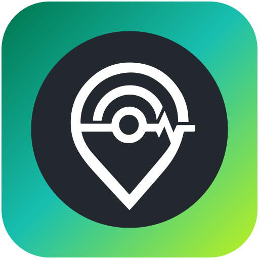
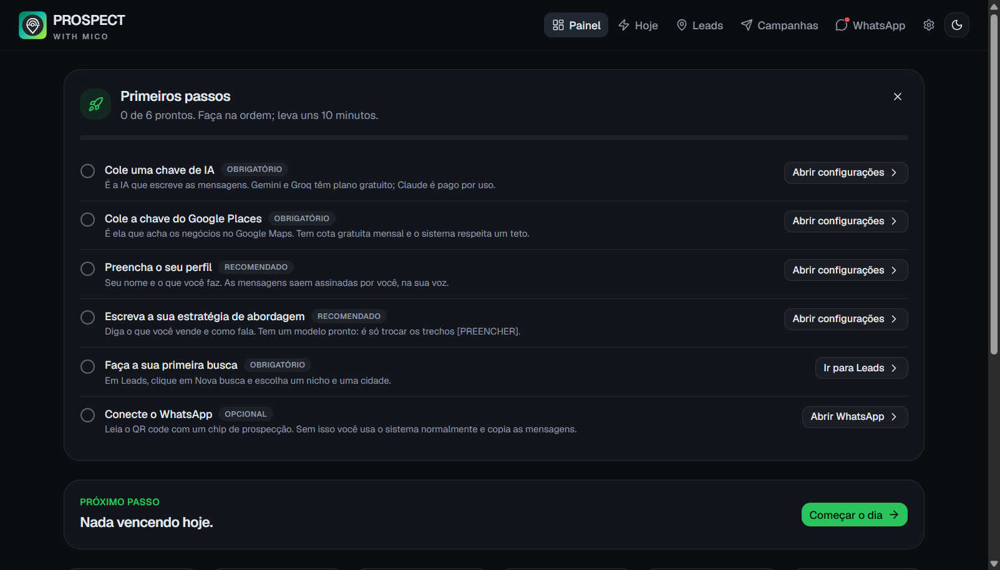

<div align="center">



# PROSPECT WITH MICO

**por MICO TECH**

### Ache negócios que precisam de você, abra a conversa e acompanhe até fechar. Tudo rodando no seu computador.

Busca no Google Maps, nota de prioridade, mensagem escrita por IA na sua voz,
envio pelo WhatsApp e um CRM visual do primeiro contato ao fechamento.




</div>

---

## O que é

O **PROSPECT WITH MICO** é uma ferramenta de prospecção para quem vende serviços
digitais (sites, WhatsApp, redes sociais, tráfego, Google Meu Negócio, automação)
para **negócios locais**: clínicas, estéticas, restaurantes, academias, lojas,
escritórios.

Ele resolve a parte chata e repetitiva do processo, de ponta a ponta:

1. **Acha** os negócios no Google Maps, por nicho e cidade (ou por pino e raio num mapa).
2. **Analisa** cada um (tem site? está no ar? é lento? foi feito em construtor?) e dá uma **nota de 0 a 100** pra você saber por quem começar.
3. **Escreve** a mensagem de abordagem com IA, na sua voz, seguindo a sua estratégia.
4. **Envia** pelo WhatsApp, com ritmo humano, e **mostra as respostas** dentro do sistema.
5. **Acompanha** cada lead num funil (novo, contatado, respondeu, fechou) com follow-up agendado.

Não é um SaaS: roda na sua máquina, os leads ficam no seu computador e as chaves de
API são as suas.

## O que vem dentro

| Área | O que faz |
|---|---|
| **Busca no Google Maps** | Nicho + cidade, ou pinos e raio num mapa, com catálogo de 170+ nichos. Usa a API oficial Google Places, com teto mensal de consultas pra você ficar na cota gratuita |
| **Análise do site** | Detecta sem site, fora do ar, sem HTTPS, lento, não adaptado pro celular ou feito em construtor pronto (Wix, Canva...). Site ruim também é lead |
| **Raio-X e diagnóstico em PDF** | O que o site tem e o que falta (WhatsApp, telefone, mapa, fotos...), com relatório de uma página pronto pra mandar ao lead |
| **Nota de prioridade** | Score 0-100 (reputação, volume de avaliações, situação do site), com pesos editáveis em `backend/pesos_score.json` |
| **Mensagens por IA** | Copy de primeiro contato e follow-up na sua voz. Usa Claude, Gemini, Groq ou NVIDIA e troca de provedor sozinho se um falhar ou ficar sem cota |
| **Sua estratégia** | Um texto seu (o que você vende, tom, o que nunca dizer) que manda no gerador. Vem com modelo pronto pra você preencher |
| **Tela "Hoje"** | Modo foco: um lead por vez, follow-ups vencidos primeiro, atalhos de teclado |
| **WhatsApp integrado** | Conecta por QR code (Evolution API local), envia pelo sistema, e as respostas dos leads entram sozinhas no histórico |
| **Campanhas em lote** | Intervalo aleatório, pausa longa a cada N envios, janela de horário, aquecimento do chip, parada automática após falhas, opt-out respeitado |
| **Resposta automática (opcional)** | A IA conversa com quem respondeu e para quando o lead esquenta, avisando você |
| **Análise de oportunidade** | Para os melhores leads, a IA aponta a principal oportunidade, a evidência e o ângulo de abordagem |
| **CRM visual** | Funil, Kanban, tags, observações, histórico de status, exportação CSV e analytics por nicho |
| **Importação de contatos** | Cole ou envie um CSV (Kaptar ou "Nome, telefone" por linha) e vire lead |

## Primeiro uso em 10 minutos

**Você precisa de:** Windows 10/11, [Python 3.11+](https://www.python.org/downloads/) e
[Node.js 20+](https://nodejs.org/). O [Docker Desktop](https://www.docker.com/products/docker-desktop/)
só é necessário se for usar o WhatsApp integrado.

1. Baixe o projeto (botão **Code > Download ZIP**, ou `git clone`) e abra a pasta.
2. Dê dois cliques em **`iniciar.bat`**. Na primeira vez ele cria os arquivos de configuração,
   instala o que falta e abre o sistema no navegador (`http://localhost:5173`).
3. Siga o checklist **Primeiros passos** que aparece no Painel: cole uma chave de IA, cole a chave
   do Google Places, preencha o seu perfil e faça a primeira busca.

O passo a passo completo, com onde pegar cada chave, está em
**[docs/PRIMEIROS-PASSOS.md](docs/PRIMEIROS-PASSOS.md)**.

## O que você precisa trazer

**Este projeto não vem com nenhuma chave de API.** As chaves são suas, ficam só no seu
computador e você paga (ou usa o plano gratuito) direto com cada provedor:

| Para quê | Provedor | Custo |
|---|---|---|
| Achar negócios (obrigatória) | Google Places API | Tem cota gratuita mensal. O Google exige uma conta de faturamento ativa; o sistema respeita um teto de consultas pra você não passar da cota |
| Escrever mensagens (pelo menos uma) | Gemini, Groq, NVIDIA ou Claude | Gemini, Groq e NVIDIA têm plano gratuito. O Claude cobra por uso |
| Nota de desempenho no PDF (opcional) | Google PageSpeed | Gratuito |
| WhatsApp (opcional) | Evolution API, que sobe local via Docker | Gratuito. Você só precisa de um chip |

## Seus dados ficam com você

- Os leads ficam num banco **SQLite no seu computador** (`backend/leads.db`). Nada é enviado para a MICO TECH.
- As chaves coladas pela tela ficam no **cofre de credenciais do Windows**, fora do banco de leads. (Se o cofre estiver indisponível, o sistema registra no log e usa o banco local como reserva.)
- O sistema só fala com os serviços que você configurar: Google (busca), o provedor de IA que você escolheu,
  o seu WhatsApp (via Evolution rodando local) e os sites dos leads (pra analisá-los).
- Backup automático do banco antes de cada busca, em `backend/backups/`.
- Os arquivos `.env`, o banco e a sua estratégia de abordagem **não entram no Git** (veja o `.gitignore`).
  Se for versionar o seu uso, não force a inclusão deles.

## Cuidados importantes (leia antes de disparar)

- **WhatsApp pode banir o número.** Automatizar o WhatsApp vai contra os termos da Meta e traz risco real de
  bloqueio. Use um **chip separado do seu número oficial**, comece com volume baixo e deixe o aquecimento subir aos poucos.
  Defina `NUMERO_OFICIAL` no `backend/.env` e o sistema **recusa campanha** nesse número.
- **Sem link no primeiro contato.** É o que mais gera denúncia. A campanha recusa template com link.
- **Respeite quem pede pra sair.** Resposta como "não tenho interesse" ou "pare" tira o lead de todas as campanhas.
- **LGPD e termos de uso.** Você é o responsável pela forma como usa os dados e as plataformas. Prospecte só
  negócios (pessoa jurídica), identifique-se e ofereça saída fácil.
- **Módulo Instagram é experimental e não tem tela.** Automatiza uma conta pessoal e pode causar bloqueio. Veja
  `backend/instagram/LEIA-ME.md` antes de pensar em usar.
- **Sem garantia de funcionamento contínuo.** Google, Meta e provedores de IA mudam regras e preços. Software
  fornecido "como está", sem garantias (veja `LICENSE`).

## Perguntas comuns

**Preciso saber programar?** Não pra usar. Você mexe só na interface e em arquivos de texto.

**Funciona em Mac ou Linux?** Hoje o projeto é feito e testado pra Windows (os scripts `.bat` e o cofre de credenciais).

**Dá pra usar sem WhatsApp integrado?** Dá. Você gera a mensagem, copia e envia do jeito que preferir. O Docker não é necessário.

**Posso trocar o nicho (não é só clínica)?** Pode. Qualquer nicho que apareça no Google Maps. Os textos de exemplo
são genéricos e a sua estratégia de abordagem define o que você oferece.

**Quero apagar tudo e começar do zero.** Feche o sistema, apague `backend/leads.db` e abra de novo. Tem backup em `backend/backups/`.

**Como rodo os testes?**
```powershell
cd backend
py -m venv .venv
.venv\Scripts\python -m pip install -r requirements.txt
.venv\Scripts\python -m pytest -q
```

## Estrutura

```
prospect-with-mico/
├── iniciar.bat            # sobe tudo (backend, interface e WhatsApp) com dois cliques
├── configurar.bat         # cria os .env com chaves geradas na sua máquina
├── parar.bat              # desliga tudo (fechar a aba não desliga)
├── backend/               # Flask + SQLite: busca, análise, IA, WhatsApp, campanhas
│   ├── .env.example       # modelo das suas chaves (nenhuma vem preenchida)
│   ├── estrategia_abordagem.exemplo.md   # modelo da sua estratégia
│   └── tests/             # suíte de testes (pytest)
├── frontend/              # React + TypeScript + Vite + Tailwind
├── whatsapp/              # Evolution API em Docker (só escuta no seu computador)
└── docs/                  # primeiros passos e contrato backend/frontend
```

## Suporte e contato

Dúvidas ou quer saber mais sobre o PROSPECT WITH MICO? Fale direto no WhatsApp:

**[+55 81 99840-1271](https://wa.me/5581998401271?text=Oi!%20Vim%20pelo%20GitHub%20e%20quero%20saber%20mais%20sobre%20o%20PROSPECT%20WITH%20MICO)**

## Licença e créditos

Licença [MIT](LICENSE). O PROSPECT WITH MICO, da MICO TECH, é derivado do
[ProspectOS](https://github.com/nando0x/ProspectOS) (MIT, de Fernando), com as adições
da MICO TECH: envio pelo WhatsApp, campanhas, resposta automática, análise de oportunidade,
busca pela Google Places API e o onboarding.

Também usa, entre outros: [Evolution API](https://github.com/EvolutionAPI/evolution-api) (ponte com o WhatsApp),
[shadcn/ui](https://ui.shadcn.com/), [Leaflet](https://leafletjs.com/) + OpenStreetMap, Flask e React.
Sem afiliação com Google, Meta/WhatsApp, Anthropic ou os demais provedores citados.
